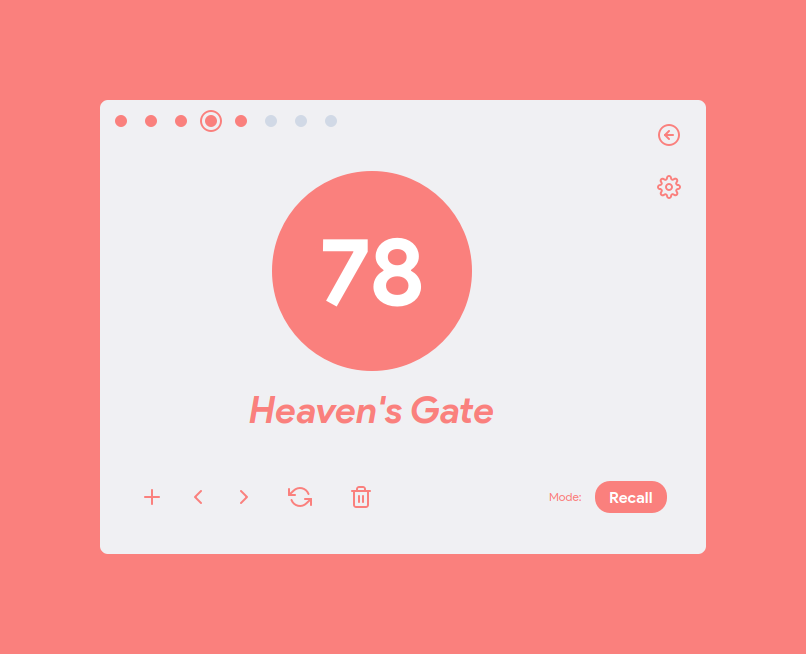

# AS91896

## Installation
Dependencies found in [pipfile](Pipfile)
I reccommend using `pipenv` for running the program as it automatically installs all the necessary dependencies - just run `pipenv sync` in the root directory. Otherwise, just install the packages in [pipfile](Pipfile) manually.

## Running
Run the following command in the root directory:

### With pipenv:
`pipenv run python -m bingo.src.main`

### Without pipenv:
`python -m bingo.src.main`

## Files I wrote (non-generated)
 - [bingo/src/ballgenerator.py](bingo/src/ballgenerator.py) - BallGenerator class
 - [bingo/src/main.py](bingo/src/main.py) - Starts the program

 - [bingo/src/ui/src/main.py](bingo/src/ui/src/main.py) - MainWindow logic and event slots
 - [bingo/src/ui/src/settings.py](bingo/src/ui/src/settings.py) - SettingsWindow logic

I also designed all the ui designs using QtDesigner. They can be found in [bingo/src/ui/design](bingo/src/ui/design)